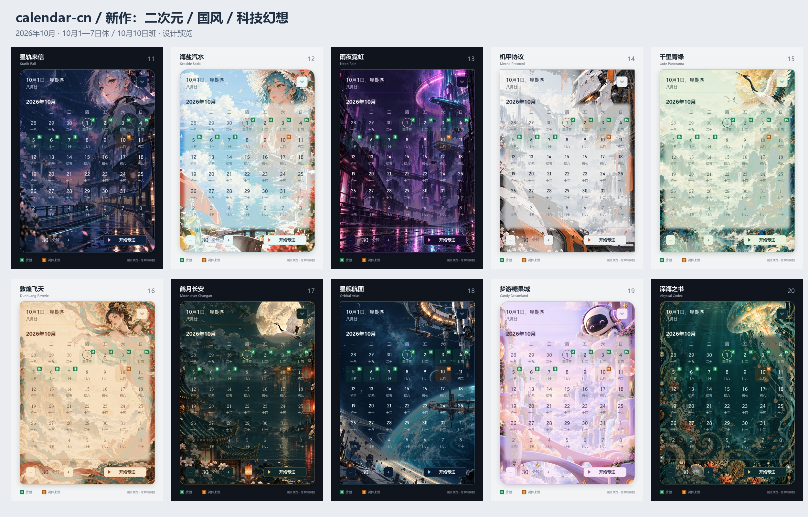
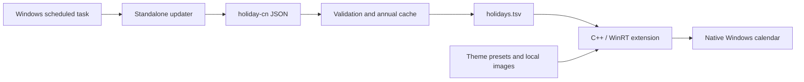

# calendar-cn

[Download the installer](https://github.com/wumingzhidewu/calendar-cn/releases) · [Changelog](CHANGELOG.md)

[简体中文](README.md)

Chinese holiday and adjusted-workday badges, plus themes, for the native Windows taskbar calendar. Clicking the taskbar clock still opens the Windows calendar. Date selection, the lunar calendar and the Focus controls keep their original roles.

A green **休** badge means a scheduled day off. An orange **班** badge means an adjusted working day. A separate updater checks annual announcements and adds next year's data when it becomes available.



These are design previews, not screenshots of the modified system calendar. Chinese text, dates, lunar dates and badges are typeset by code. GPT Image generated the backgrounds. This collection adds ten anime, Chinese-art, science-fiction and fantasy themes. The previous ten remain available, for twenty themes in total. The repository includes the artwork, complete prompts, palettes and native style presets.

## Supported systems

The current release is **0.5.3-preview**. The installer accepts **Windows 11 23H2, build 22631, x64** only. Windows 10, ARM64 and other Windows 11 builds are not supported.

Prototype injection, unloading/reloading, installer cleanup and scheduled data updates have been tested. Theme configuration has file-level tests, and the manager compiles. Actual theme rendering, DPI behavior and first injection in a clean login session still require testing. The installer is unsigned.

## Installation

End users need `Calendar-CN-Setup-0.5.3-x64.exe`. Python, a separate Windhawk installation and a compiler are **not required**.

1. Run the installer and approve elevation using the currently signed-in account.
2. Finish the wizard, then click the clock in the bottom-right corner.
3. Open “中国节假日日历” from the Start menu to manage badges and themes.

The installer uses `%LOCALAPPDATA%\NativeCalendarHolidaysDesktop`. It creates Start menu shortcuts, a Windows uninstall entry and two scheduled tasks: enabling the badges after login and updating holiday data. It does not replace Windows system files.

Installation stops if another Windhawk instance is running. Uninstall an older preview before upgrading. Do not supply credentials for a different administrator account; the installer rejects that situation to avoid installing into the wrong profile.

This repository contains source. Builds normally place the installer under the local `releases/` directory. Distribute the installer as a Release asset rather than asking end users to run the source tree.

## Daily use

The manager currently uses a Chinese interface.

| Control | What it does |
| --- | --- |
| Taskbar clock | Opens the native calendar with the holiday badges |
| 启用标记 — Enable | Starts this installation's loader |
| 暂停本次 — Pause | Stops it for the current session; login startup remains enabled |
| 立即更新数据 — Update now | Starts a background data check |
| 查看状态 — Status | Shows the last successful check and available years |
| 应用主题 — Apply theme | Saves the theme and background mode and requests a style reload |
| 卸载 — Uninstall | Stops this installation and removes its tasks and files |

Closing the manager window does not stop the badges. To remove the application, use Windows Settings → Apps → Installed apps, or the manager's Uninstall button.

## Themes

Choose a theme and a background mode, then click Apply theme. Reopen the system calendar to inspect the result. If Windows keeps the old styles, pause and enable the badges again. “系统默认” restores the style configuration saved before the first theme application; holiday badges remain enabled.


### New expressive collection

New themes appear first in the component selector with a “新 ·” prefix. Updates preserve the current selection.

| Theme | Direction |
| --- | --- |
| Starlit Rail | Anime courier and a cosmic railway station |
| Seaside Soda | Anime coastal travel |
| Neon Rain | Cyberpunk city and wet-street reflections |
| Mecha Protocol | Ceramic armor and industrial mecha |
| Jade Panorama | Blue-green Chinese landscape, gold lines and cranes |
| Dunhuang Reverie | Mural colors, a celestial dancer and flowing silk |
| Moon over Changan | Palace roofs, lanterns, a moon and a crane |
| Orbital Atlas | Orbital station and a planetary horizon |
| Candy Dreamland | Tactile clay city and an original astronaut mascot |
| Abyssal Codex | Art-nouveau jellyfish and deep-sea ornament |

See the [art directions and complete prompts](docs/design/expressive/ART_DIRECTION.md). Reading layers are adjusted to image luminance. Technical themes use Bahnschrift numerals; Chinese-art themes use SimSun numerals. The green/orange badge meanings remain unchanged.

### Previous collection
| Theme | Chinese name | Mode |
| --- | --- | --- |
| Frosted Azure | 霜蓝云雾 | Light |
| Moonlit Ink | 月白山水 | Light |
| Moss Garden | 森间苔绿 | Light |
| Amber Paper | 琥珀书页 | Light |
| Sakura Dawn | 樱色晨光 | Light |
| Midnight Tide | 深海静夜 | Dark |
| Aurora Violet | 极光紫境 | Dark |
| Graphite Studio | 石墨极简 | Dark |
| Vermilion Seal | 朱砂新笺 | Light |
| Desert Dusk | 落日陶土 | Light |

Each theme provides artwork, gradient and solid-color backgrounds. Presets change the background, text, border, corner radius and selection colors. They do not replace day-item templates or change holiday data.

Open the local [theme gallery](docs/design/index.html) in a browser after checkout for full previews. Edit `themes/catalog.json` to change palettes, then run `python theme_presets.py`. Runtime images are in `themes/assets/`; generated XAML presets are in `themes/presets/`.

## Automatic holiday updates

The source is [NateScarlet/holiday-cn](https://github.com/NateScarlet/holiday-cn), a third-party JSON dataset compiled from State Council notices. Each file retains government links in its `papers` field. Official notices remain authoritative.

- Check every seven days, with no login trigger. Missed runs may run later. Automatic runs skip network access if the last successful check was less than seven days ago; manual updates can bypass this interval.
- Fetch the previous, current and next year based on the date of each run. In 2027 the window becomes 2026, 2027 and 2028 automatically.
- Try the same repository through jsDelivr if GitHub cannot be reached.
- Validate dates, field types, duplicate entries and source URLs before accepting a download.
- Keep published data when the next-year file is only an empty placeholder. Preserve cached data on network failures until the next seven-day check or a manual update.
- Merge accepted data, replace the local TSV and retain the previous version. The calendar extension checks it once per minute while its host process is running.

The updater is a standalone executable. It does not require Codex, a system Python installation or the source directory. It updates data only; it does not download new program code.

The bundled cache contains notice years 2007–2026. The 2027 file was an empty placeholder when checked on September 21, 2026. Adjusted working days cannot be calculated from lunar dates alone; they must wait for an official announcement and its inclusion in the dataset.

`holidays.tsv` is a generated UTF-8 cache with tab-separated fields:

```text
20260925	1	中秋节
20261010	0	国庆节
```

The fields are date, day-off flag and holiday name. `1` produces a 休 badge; `0` produces a 班 badge. Missing dates receive no badge. A missing entry does not mean the date is a working day, and ordinary weekends are not automatically marked as statutory holidays.

## Architecture



Windhawk loads this project's DLL into `ShellExperienceHost.exe` only. XAML diagnostics identify `CalendarViewDayItem` controls. The extension reads each control's actual date, adds the appropriate badge and stores original values for restoration. Recycled day items are checked every 250 ms. Windows suspends these timers when it suspends the calendar host.

Networking belongs to the separate updater. Theme images are local files. Theme selection updates Windhawk settings, so changing colors does not require restarting Explorer.

## Development and builds

Developers need Python 3.10+, the complete Windhawk 1.7.3 portable toolchain and NSIS 3.12. End users do not need them.

```powershell
python -m unittest discover -s tests -v
python manage.py data
python theme_presets.py
python manage.py build --windhawk C:\Tools\Windhawk
python -m pip install -r requirements-build.txt
python manage.py build-updater
python installer\build_installer.py --windhawk C:\Tools\Windhawk --nsis C:\Tools\NSIS\makensis.exe --output releases\Calendar-CN-Setup-0.5.3-x64.exe
```

Create the output directory first. Git ignores `build/`, `releases/`, temporary files and local key configuration.

Maintenance commands:

```powershell
python manage.py update --years 2025 2026 2027
python manage.py auto-status --path "$env:LOCALAPPDATA\NativeCalendarHolidaysDesktop"
python manage.py disable-auto --path "$env:LOCALAPPDATA\NativeCalendarHolidaysDesktop"
python manage.py enable-auto --path "$env:LOCALAPPDATA\NativeCalendarHolidaysDesktop"
```

Use the Windows uninstall entry for the desktop installer edition. `manage.py uninstall` refuses to remove it directly, which avoids leaving the login task behind. The developer CLI installation has a different startup policy; see [installer notes](docs/DESKTOP_INSTALLER.md).

## Repository layout

```text
src/                 C++ holiday badges
installer/           NSIS installer, native manager, theme controls
themes/              Twenty palettes, background images and XAML presets
data/                Annual JSON, merged cache and provenance manifest
docs/design/         Reference, generated artwork and theme previews
tools/               Preview rendering tools
tests/               Data, updater, management and theme tests
vendor/              Pinned upstream source
auto_updater.py       Standalone updater entry point
holiday_data.py       Data validation and merging
scheduler.py          Scheduled update management
manage.py             Developer commands
```

## Troubleshooting

**No badges appear.** Check the manager's status, reopen the calendar and confirm that the date is covered by the dataset. Make sure another Windhawk instance is not running. After changing loader paths, a suspended calendar host may retain a module from the previous installation. First injection in a clean login session still needs verification.

**The background does not appear.** Try gradient or solid mode. Artwork mode relies on XAML loading a local image and is not yet verified for every theme. Record the Windows build, display scaling and selected theme when reporting a problem.

**The installer rejects a newer Windows build.** The extension depends on internal calendar controls. Untested builds are deliberately not accepted.

**Does changing a theme alter holiday data?** No. Themes do not modify annual data. Badges use a separate overlay without replacing native day-item templates. System default restores appearance; Pause stops the badges.

**Does an end user need Python?** No. Python is needed only for development, rebuilding or maintenance commands from the source tree.

## License

Code is GPL-3.0. The XAML integration derives from m417z's Notification Center Styler and Windhawk, with original sources and notices retained. Holiday data is MIT-licensed. Corresponding source and notices are included with the installer; see [THIRD_PARTY_NOTICES.md](THIRD_PARTY_NOTICES.md).
