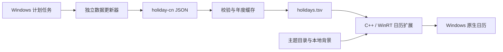

# calendar-cn

[下载安装包](https://github.com/wumingzhidewu/calendar-cn/releases) · [版本记录](CHANGELOG.md)

[English](README.en.md)

给 Windows 任务栏右下角的原生日历加上中国节假日、调休标记和主题。点击时间打开的仍是系统日历，日期选择、农历和专注入口保持原来的操作方式。

绿色 **休** 表示放假，橙色 **班** 表示调休上班。数据由独立更新器定期获取，下一年的安排公布后自动加入。


上图是设计预览，不是系统实拍。中文、日期、农历和休班标记由代码排版，背景图由 GPT Image 生成。本批新增十套二次元、国风、科技与幻想主题。原有十套保留，组件共二十套；原图、完整提示词、配色和样式配置均在仓库中。

## 支持范围

当前版本为 **0.5.3-preview**，安装包仅允许 **Windows 11 23H2、内部版本 22631、x64**。不支持 Windows 10、ARM64 或其他 Windows 11 版本。

已验证原型注入、卸载重载、安装卸载及自动更新任务。主题配置切换已做文件级测试，管理程序可以编译。0.5.3 的连续滚动同步、全部主题在不同缩放下的布局、全新登录会话中的首次注入仍待实机验收。安装包未做代码签名。

## 安装

普通用户使用 `Calendar-CN-Setup-0.5.3-x64.exe`。运行依赖已经包含在安装包中，不需要另装 Python、Windhawk 或编译器。

1. 双击安装包，用当前登录账户完成管理员授权。
2. 按向导安装，点击任务栏右下角时间查看日历。
3. 在开始菜单打开“中国节假日日历”，可以管理标记和主题。

程序安装在 `%LOCALAPPDATA%\NativeCalendarHolidaysDesktop`。安装过程会添加开始菜单入口、Windows 卸载登记和两项计划任务：登录后启用标记，以及定期更新节假日数据。它不会替换 Windows 系统文件。

如果另一套 Windhawk 正在运行，安装会退出。升级预览版前请先卸载旧版。不要使用另一账户的管理员凭据安装，以免装到错误的用户目录。

本仓库保存源码；安装包由下面的构建流程生成，通常放在本地 `releases/` 目录。发布时应将安装包作为 Release 附件分发，不要让普通用户下载源码后自行运行。

## 日常使用

| 操作 | 说明 |
| --- | --- |
| 点击右下角时间 | 打开原生日历，查看日期格内的“休／班” |
| 启用标记 | 启动本程序的加载器 |
| 暂停本次 | 退出加载器，恢复原外观；下次登录重新启用 |
| 立即更新数据 | 在后台检查年度安排，不会弹出命令行窗口 |
| 查看状态 | 查看运行状态、最近成功更新时间和已有数据年份 |
| 应用主题 | 保存选定的主题与背景类型，通知日历重新读取样式 |
| 卸载 | 停止本实例，移除任务和安装文件 |

关闭管理窗口不会暂停日历标记。需要完全移除时，可以从 Windows“设置 → 应用 → 已安装的应用”中卸载，也可以使用管理窗口的卸载按钮。

## 主题

在管理窗口中选择主题，再选择背景类型，点击“应用主题”。重新展开系统日历查看结果；若系统仍保留旧样式，可暂停再启用。选择“系统默认”会恢复首次应用主题前的样式配置，不会关闭节假日标记。


### 新增艺术主题

新主题位于组件下拉列表顶部，名称前带“新 ·”。更新会保留当前选择。

| 主题 | 方向 |
| --- | --- |
| 星轨来信 | 二次元星际信使与车站 |
| 海盐汽水 | 二次元海边旅行 |
| 雨夜霓虹 | 赛博城市与雨夜反射 |
| 机甲协议 | 陶瓷装甲与工业机甲 |
| 千里青绿 | 青绿山水与金线白鹤 |
| 敦煌飞天 | 壁画、飞天与飘带 |
| 鹤月长安 | 宫阙夜景、灯笼与月下鹤 |
| 星舰航图 | 轨道站与行星弧面 |
| 梦游糖果城 | 立体黏土城市与太空小角色 |
| 深海之书 | 新艺术装饰风格的水母与海底 |

[设计说明与完整提示词](docs/design/expressive/ART_DIRECTION.md)。阅读层按画面亮度处理；科技主题使用 Bahnschrift 数字，国风主题使用宋体数字。休／班的绿色和橙色含义不变。

### 原有主题
| 主题 | 英文名 | 明暗 |
| --- | --- | --- |
| 霜蓝云雾 | Frosted Azure | 浅色 |
| 月白山水 | Moonlit Ink | 浅色 |
| 森间苔绿 | Moss Garden | 浅色 |
| 琥珀书页 | Amber Paper | 浅色 |
| 樱色晨光 | Sakura Dawn | 浅色 |
| 深海静夜 | Midnight Tide | 深色 |
| 极光紫境 | Aurora Violet | 深色 |
| 石墨极简 | Graphite Studio | 深色 |
| 朱砂新笺 | Vermilion Seal | 浅色 |
| 落日陶土 | Desert Dusk | 浅色 |

每套提供三种背景：插画、渐变、纯色。主题调整背景、文字颜色、边框、圆角和选中状态颜色，不替换日期格模板，也不修改调休数据。

完整预览见 [主题图册](docs/design/index.html)，下载后在浏览器中打开。主题定义在 `themes/catalog.json`，背景在 `themes/assets/`，导出的 XAML 配置在 `themes/presets/`。修改配色后运行 `python theme_presets.py` 重新导出。

## 节假日数据怎样更新

数据来自 [NateScarlet/holiday-cn](https://github.com/NateScarlet/holiday-cn)。它按国务院办公厅公告整理 JSON，每个文件的 `papers` 字段保留公告链接。来源为第三方整理，应以官方公告为准。

- 每七天联网检查一次，不再随登录触发；错过的任务允许补跑。距上次成功检查不足七天时自动跳过，手动“立即更新”不受此限制。
- 检查执行当天的上一年、当年、下一年。进入 2027 年后，范围自动变为 2026、2027、2028。
- GitHub 请求失败时尝试同仓库的 jsDelivr 镜像。
- 下载内容通过日期、字段、重复记录及公告链接校验后才写入缓存。
- 尚未公布的空文件不覆盖已有正式数据。网络失败时继续使用缓存，等待下一次七天计划，或手动“立即更新”。
- 新数据合并后替换本地 TSV；保留上一版备份。日历进程运行时，每分钟重新读取一次。

更新器是独立 EXE，运行不依赖 Codex、系统 Python 或项目源码目录。它只更新数据，不会下载并替换程序代码。

当前缓存包含 2007—2026 年的通知数据。2027 年文件在 2026-09-21 核验时为空占位。未来补班安排不能只靠农历计算，需要等待正式公布及数据源收录。

`holidays.tsv` 是项目生成的 UTF-8 缓存，列间为 Tab：

```text
20260925	1	中秋节
20261010	0	国庆节
```

三列分别是日期、是否放假、节日名称。`1` 显示“休”，`0` 显示“班”。没有列出的日期不加标记，不代表一定上班；普通周末也不会自动变成法定假日标记。

## 架构



Windhawk 只向 `ShellExperienceHost.exe` 加载本项目 DLL。扩展通过 XAML 诊断接口识别 `CalendarViewDayItem`，读取真实日期后添加标记，并记录修改前的值用于恢复。日期控件复用检查周期为 250ms。Windows 挂起日历进程时，计时器也会暂停。

联网在独立更新器中完成。主题图片使用本地文件，不需要联网。主题样式通过 Windhawk 配置刷新，加载器和系统资源管理器无需因换色而重启。

## 开发和构建

开发环境需要 Python 3.10+、Windhawk 1.7.3 的完整便携目录、NSIS 3.12。普通用户不需要这些工具。

```powershell
python -m unittest discover -s tests -v
python manage.py data
python theme_presets.py
python manage.py build --windhawk C:\Tools\Windhawk
python -m pip install -r requirements-build.txt
python manage.py build-updater
python installer\build_installer.py --windhawk C:\Tools\Windhawk --nsis C:\Tools\NSIS\makensis.exe --output releases\Calendar-CN-Setup-0.5.3-x64.exe
```

构建目录需预先存在。`build/`、`releases/`、临时文件和本地密钥配置不会纳入 Git。

常用维护命令：

```powershell
python manage.py update --years 2025 2026 2027
python manage.py auto-status --path "$env:LOCALAPPDATA\NativeCalendarHolidaysDesktop"
python manage.py disable-auto --path "$env:LOCALAPPDATA\NativeCalendarHolidaysDesktop"
python manage.py enable-auto --path "$env:LOCALAPPDATA\NativeCalendarHolidaysDesktop"
```

安装包版本请使用 Windows 的卸载入口；`manage.py uninstall` 会拒绝直接删除它，避免遗留登录任务。开发者命令行安装与桌面安装包的行为区别见 [安装说明](docs/DESKTOP_INSTALLER.md)。

## 目录

```text
src/                 C++ 日历标记
installer/           NSIS 安装器、原生管理窗口、主题控制
themes/              二十套主题配色、背景、XAML 配置
data/                原始年度 JSON、合并缓存、来源清单
docs/design/         原截图、生成背景、主题设计图册
tools/               预览图排版工具
tests/               数据、更新器、管理和主题测试
vendor/              固定版本上游源码
auto_updater.py       独立更新器入口
holiday_data.py       数据校验与合并
scheduler.py          更新任务管理
manage.py             开发维护命令
```

## 常见问题

**安装后没有标记。** 先检查管理窗口的状态，再重新打开右下角日历。确认日期在已有数据范围内，以及没有另一套 Windhawk 正在运行。跨路径切换加载器后，Windows 可能仍在挂起的日历进程中保留旧模块；干净登录会话中的首次注入仍需验证。

**背景没有出现。** 先切到渐变或纯色模式。插画模式依赖 XAML 读取本地图片，当前尚未完成各主题的实机验收。记录 Windows 版本、缩放和所选主题，便于定位问题。

**为什么不能装在新版 Windows 11？** 这个扩展依赖系统日历的内部控件结构。尚未验证的版本不会直接放开安装。

**修改了背景，会不会影响休班标记？** 主题配置不修改年度数据；标记使用独立覆盖层，不替换日期格模板。“系统默认”只恢复外观；要关闭标记，使用“暂停本次”。

**普通用户要安装 Python 吗？** 不需要。只有修改源码、重新构建或运行开发命令时才需要 Python。

## 许可

代码采用 GPL-3.0。XAML 注入基础来自 m417z 的 Notification Center Styler 和 Windhawk，保留了原始源码与声明。节假日数据采用 MIT 许可。安装包内包含相应源码和许可证，详见 [THIRD_PARTY_NOTICES.md](THIRD_PARTY_NOTICES.md)。
