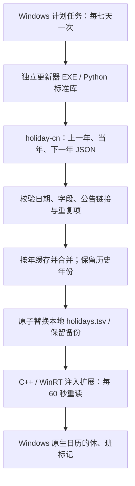

# 自动获取下一年调休数据

## 架构



联网只发生在更新器里，日历进程本身不联网。更新器不下载或执行上游代码，只获取 JSON 数据。GitHub 不可达或响应不合法时尝试同仓库的 jsDelivr 镜像，仍须通过相同校验。更新器已打包为独立 EXE，运行不依赖 Codex、项目源码目录或系统另装 Python。

## 下一年如何自动接入

检查年份取自执行当天的系统日期，不写死：

- 2026 年运行：检查 2025、2026、2027。
- 2027 年运行：自动变为检查 2026、2027、2028。
- 既有 2007—2026 年缓存不会因为检查范围滚动而被删除。

上游下一年文件如果 `papers`、`days` 均为空，记录为“尚未公布”，不虚构日期、不覆盖已有正式数据。上游公布后，下一次成功检查自动下载、合并和部署，用户无需导入，也不必重新编译 DLL。

“每年会自动检查”不代表提前有未来的调休安排。它依赖正式公告发布和上游及时整理，下载成功时间也受网络及镜像缓存影响。

## 默认调度与失败处理

- 每七天检查一次；不随登录触发，错过的计划允许补跑。
- 距上次成功检查不足七天时，更新器自动跳过联网；“立即更新”可手动绕过间隔。
- 失败后保留缓存，等待下一次计划或手动更新，不做频繁重试。
- 只在当前用户已登录时运行，不需要保存账户密码。
- 普通用户权限运行更新器，不请求管理员权限；下载不弹窗口。
- 同一个实例并发时跳过新任务；程序还对缓存更新加锁。
- 断网、错误响应、损坏缓存不清空正在使用的数据；错误写入状态文件。
- 数据未变化不重写运行时 TSV；有变化先保留上一版备份。
- 日历进程被 Windows 挂起时，60 秒重读计时暂停；打开日历恢复运行后继续读取。

## 构建与管理

源码构建需要 Python 3.10+。已提供构建好的 EXE 时无需重建：

```powershell
python -m pip install -r requirements-build.txt
python manage.py build-updater
```

0.2.0 起，`manage.py install` 默认注册自动数据更新；`--no-auto-update` 可只安装运行文件。

```powershell
python manage.py enable-auto
python manage.py auto-status
python manage.py disable-auto
```

给本次会话之前安装的原型添加自动更新，不更换它的 DLL：

```powershell
python manage.py enable-auto --path "$env:LOCALAPPDATA\NativeCalendarHolidays" --attach-existing
python manage.py auto-status --path "$env:LOCALAPPDATA\NativeCalendarHolidays"
python manage.py disable-auto --path "$env:LOCALAPPDATA\NativeCalendarHolidays"
```

安装后即使项目源码移动或删除，自动更新仍运行，因为 EXE、脚本、缓存和配置均在安装目录的 `AutoUpdate` 下。

## 状态与文件

```text
安装目录/
├── AutoUpdate/
│   ├── NativeCalendarHolidayUpdater.exe
│   ├── Configure-AutoUpdate.ps1
│   ├── config.json
│   ├── status.json
│   └── data/years/YYYY.json
└── AppData/Engine/Mods/64/
    ├── holidays.tsv
    ├── holidays.tsv.bak
    └── holidays.manifest.json
```

`status.json` 包含最近尝试、最近成功检查、最近数据变化、请求年份、已公布年份、未公布年份、失败年份与已部署数据的 SHA-256。计划任务退出码 `0` 表示本次正常完成，`1` 表示更新存在失败（保留缓存），`2` 表示配置/启动失败。并发或七天间隔内跳过也返回 `0`，需结合时间戳确认是否完成新检查。

任务名称由安装路径生成稳定后缀，重复启用更新现有任务；发现同名任务运行其他程序时拒绝覆盖。卸载本项目管理的安装目录前会停止并移除对应任务。

自动数据更新与 Windhawk 加载器开机自启是两件事。本次启用的是数据更新任务，未改变加载器的自启设置。也没有启用软件自身的在线代码升级。
